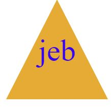

 
# UW-BootCamp-Week10-SVG-MAKER!

## Description

I created this project inorder to make quick and simple logos. The main focus of this project was actuly to practice and inprove with both inquirer, and jest testing. Durring the creation I learned how to better write jest test, and improved my learning with inquirer.

## Table of Contents (Optional)

- [Installation](#installation)
- [Usage](#usage)
- [Credits](#credits)
- [License](#license)
- [How to Contribute](#How to Contribute)
- [Tests](#Tests)
- [Questions](#Questions)

## Installation

To use this project please install inquirer@8.2.4, jest, and nodejs to your console.

## Usage

This project has one function. After installing the required items, run the index.js file using node, answer the prompts, and enjoy your simple logo. To view the logo, paste the file path into your prefred broswer.

 example video: https://youtu.be/_p63h_J_--g 
## License

Copyright 2023, DuckTurtle

    Permission is hereby granted, free of charge, to any person obtaining a copy of this software and associated documentation files (the “Software”), to deal in the Software without 
    restriction, including without limitation the rights to use, copy, modify, merge, publish, distribute, sublicense, and/or sell copies of the Software, and to permit persons to whom 
    the Software is furnished to do so,subject to the following conditions:
    The above copyright notice and this permission notice shall be included in all copies or substantial portions of the Software.
    THE SOFTWARE IS PROVIDED “AS IS”, WITHOUT WARRANTY OF ANY KIND, EXPRESS OR IMPLIED, INCLUDING BUT NOT LIMITED TO THE WARRANTIES OF MERCHANTABILITY, FITNESS FOR A PARTICULAR PURPOSE 
    AND NONINFRINGEMENT. IN NO EVENT SHALL THE AUTHORS OR COPYRIGHT HOLDERS BE LIABLE FOR ANY CLAIM, DAMAGES OR OTHER LIABILITY, WHETHER IN AN ACTION OF CONTRACT, TORT OR OTHERWISE, 
    ARISING FROM, OUT OF OR IN CONNECTION WITH THE SOFTWARE OR THE USE OR OTHER DEALINGS IN THE SOFTWARE.
(https://opensource.org/licenses/MIT)

## How to Contribute

You can contribute by adding more options for shapes!

## Tests

To test the project and run the npm test after installing jest.

## Questions

For any questions please inquirer through my git hub DuckTurtle or contact me via email at qschnell04@gmail.com.
